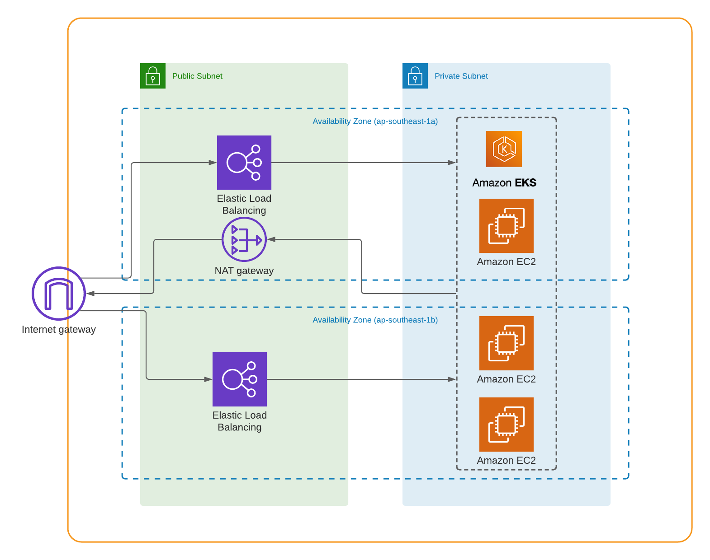

# Overview

- `gitignore` (2 files) -> {root level, platforms folder level (terraform ignorefile)}
- `editorconfig` to config editor configuration (required extension in vscode)

# Dockerfile

- Add a `Dockerfile` to containerize the app, with support for multiple environments (test, development & production)

```Dockerfile
FROM node:16-alpine

# Create app directory
WORKDIR /usr/src/app

# Install app dependencies
# A wildcard is used to ensure both package.json AND package-lock.json are copied
# where available (npm@5+)
COPY package.json package-lock.json ./

RUN NODE_ENV=production npm ci

# Bundle app source
COPY . .

USER node

ENTRYPOINT [ "npm" ]
CMD [ "start" ]

```
- I add some `.dockerignore` to ignore non-relevant file
- I change the code to accept the extra environemnt variable in `index.js`
    ```js
    const ENVIRONMENT = typeof process.env.ENVIRONMENT === 'undefined' ? 'dev' : process.env.ENVIRONMENT;
    const STATSD_PORT = typeof process.env.STATSD_PORT === 'undefined' ? 8125 : parseInt(process.env.STATSD_PORT);
    const STATSD_URL = typeof process.env.STATSD_URL === 'undefined' ? 'localhost' : process.env.STATSD_URL;
    ```
- Add some debug msg in `index.js`
    ```js
    console.log("🚀🚀🚀");
    console.log('[INFO] Run with env: ' + ENVIRONMENT);
    console.log('[INFO] Target URL is: ' + STATSD_URL);
    console.log('[INFO] Target port is: ' + STATSD_PORT);
    ```
- Change start script in `package.json`
    ```json
    "scripts": {
      "test": "echo \"PASS\" && exit 0",
      "start": "node index.js"
    },
    ```
- To create an image as
    ```bash
    docker build . -t bigdev2000/api
    ```
- process.env.`<ENV>` can be pass be passed to Container (pod) by running
    ```bash
    docker run [-e <key>="value"] <image>
    # JS code will take care of ENV var as String **
    ```
    For pod; example in `/k8s/helm/application/api-dev-values.yaml`
    ```yaml
    extraEnv:
      ENVIRONMENT: dev
      STATSD_PORT: 8125
      STATSD_URL: graphite.default.svc.cluster.local
    ```

# Docker-compose

Add a `docker-compose.yml` file to setup Node app, `statsd` & the backend. Applicants can use any backends for `statsd` (eg: `Graphite`).

```yaml
version: "3.8"
services:
  graphite:
    image: graphiteapp/graphite-statsd
    ports:
    - "80:80"
    - "2003-2004:2003-2004"
    - "2023-2024:2023-2024"
    - "8125:8125/udp"
    - "8126:8126"

```

- I use graphite official image to do `docker-compose.yaml`
- On kubernetes platform, I use `/k8s/helm/application/graphite-dev-values.yaml` instead of `docker-compose.yaml` file

# Use any IAC tools (Cloudformation, Terraform etc.) to prepare the infrastructure



## Terraform

### Folder structure

```bash
.
├── c1-versions.tf
├── c2-providers.tf
├── c3-local-values-variables.tf
├── c3-local-values.tf
├── c4-vpc-module.tf
├── c4-vpc-variables.tf
├── c5-eks-module.tf
├── c5-eks-variables.tf
└── outputs.tf
```

- `c1-version.tf` contain remote storage backend as s3
- `c2-providers.tf` contain provider (cloud aws) and profile of user
- `c3-local-values-variables.tf` contain input for `c3-local-values.tf`
- `c3-local-values.tf` contain common variable
- `c4-vpc-module.tf` contain VPC information
- `c4-vpc-variables.tf` contain input for VPC module
- `c5-eks-module.tf` conrain EKS information
- `c5-eks-variables.tf` contain input for EKS module
- `outputs.tf` contain output of EKS, VPC module

NOTE: you can override values by create file `<name>[.auto].tfvars`

For Example:
- `terraform.tfvars`
    ```python
    # Generic Variables

    aws_region = "ap-southeast-1"
    # will be used in naming format: ${business_divsion}-${environment}-${module_name}
    business_divsion = "oouzu-exam"
    environment      = "dev"
    ```
- `vpc.auto.tfvars`
    ```python
    # VPC Variables
    vpc_name               = "oouzu-vpc"
    vpc_cidr_block         = "10.0.0.0/16"
    vpc_availability_zones = ["ap-southeast-1a", "ap-southeast-1b"]
    vpc_public_subnets     = ["10.0.1.0/24", "10.0.2.0/24"]
    vpc_private_subnets    = ["10.0.101.0/24", "10.0.102.0/24"]
    vpc_enable_nat_gateway = true
    vpc_single_nat_gateway = true
    ```

### Command:

```bash
terraform validate
terraform plan
terraform apply
# To clean up
terraform destroy
```

## Kubernetes

### Folder structure

```bash
.
└── helm
    ├── application
    │   ├── Chart.yaml
    │   ├── README.md
    │   ├── api-dev-values.yaml
    │   ├── graphite-dev-values.yaml
    │   └── templates
    │       ├── deployment.yaml
    │       ├── ingress.yaml
    │       └── service.yaml
    └── ingress-nginx
        ├── README.md
        └── values-dev.yaml
```

### Ingress-nginx

To make use of accessing statsd application

```bash
cd k8s/helm/ingress-nginx/
cat README.md
```

[README](./k8s/helm/ingress-nginx/README.md)

### Install application

```bash
cd k8s/helm/application/
cat README.md
```

[README](./k8s/helm/application/README.md)

### Now you can access statsd UI via

a4b9f2ef678e74d5cbfe36b0d7ba3f0d-992520144.ap-southeast-1.elb.amazonaws.com
